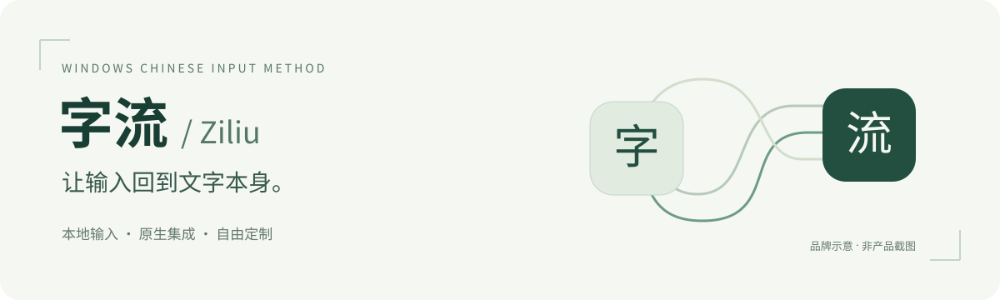
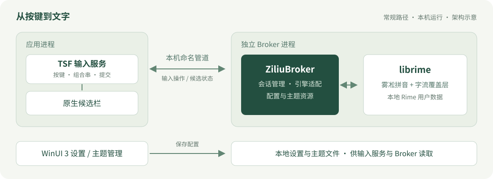

<p align="center">
  
</p>

<h1 align="center">字流 / Ziliu</h1>

<p align="center">面向 Windows 的本地中文输入法<br>Rime 输入引擎 · 原生 TSF 集成 · 可定制候选栏</p>

<p align="center">
  <a href="https://github.com/matsuokajuri/ziliu-cloud-build/actions/workflows/build.yml"></a>
  · <a href="LICENSE">GPL-3.0</a>
  · Windows 11 x64
  · 早期测试
</p>

<p align="center">
  <a href="docs/getting-started.md">开始试用</a> ·
  <a href="docs/development.md">构建与开发</a> ·
  <a href="docs/architecture.md">架构</a> ·
  <a href="docs/roadmap.md">路线图</a> ·
  <a href="CONTRIBUTING.md">参与贡献</a> ·
  <a href="#english">English</a>
</p>

## 字流是什么

字流希望把日常中文输入做得清爽、可控：沿用 Rime 与雾凇拼音的输入能力，以 Windows Text Services Framework（TSF）接入应用，并提供 WinUI 3 设置界面和原生候选栏。

这个公开仓库包含第一方源码、合成测试、必要资源、打包脚本和固定版本的公共依赖。仓库名中的 `cloud-build` 指 GitHub Actions 构建流水线；当前输入引擎在本机运行。

> **当前阶段：未签名的早期测试版。** 本分支构建版本标识为 `0.1.0-alpha.20261005.997f466`；截至 2026-10-06，仓库尚无 GitHub Release。CI 产物有保留期限，不是稳定下载渠道。绿色构建状态只代表该次流水线执行的检查通过，Windows 11 交互体验与安装验收仍需单独验证。

## 已有能力

以下能力已包含在公开源码中，实际可用范围以测试包和应用兼容性验证为准。

| 方向 | 当前实现 |
| --- | --- |
| 拼音输入 | librime + 雾凇拼音，简拼、拼写纠错与可选模糊音 |
| 文字与标点 | 简繁切换、中英文模式、全半角标点及数字场景标点处理 |
| 候选栏 | 横向 / 纵向布局、候选数量、字体、颜色和缩放设置 |
| 外观定制 | 主题清单与资源加载、预览，以及部分搜狗 `.ssf` 皮肤导入；兼容性仍在完善 |
| 系统集成 | TSF 输入服务、独立 Broker 进程、WinUI 3 设置与快捷菜单 |
| 可追溯构建 | 固定依赖、校验过的 Rime 运行时、严格测试门禁与未签名测试包 |

上下文排序、小模型与更深的输入引擎融合属于[规划与实验](docs/roadmap.md)。当前常规产品路径不启用实验性上下文排序，仓库没有发布模型权重，也没有可据此承诺的效果提升。

## 从哪里开始

| 你想做什么 | 入口 |
| --- | --- |
| 了解测试包获取、安装与卸载边界 | [试用指南](docs/getting-started.md) |
| 从源码构建、了解依赖与 CI | [开发指南](docs/development.md) |
| 理解进程边界与输入数据流 | [架构说明](docs/architecture.md) |
| 了解当前状态与后续优先级 | [路线图](docs/roadmap.md) |
| 报告问题或提出改进 | [Issues](https://github.com/matsuokajuri/ziliu-cloud-build/issues) · [贡献指南](CONTRIBUTING.md) |

准备好 Windows 开发环境后，在 **cmd.exe** 中执行：

```bat
git -c core.autocrlf=true clone --recurse-submodules https://github.com/matsuokajuri/ziliu-cloud-build.git
cd ziliu-cloud-build
set ZILIU_WINDOWS_SDK_VERSION=10.0.26100.0
powershell -NoProfile -File scripts\fetch-librime-runtime.ps1
scripts\build-local.cmd Release
```

需要 Visual Studio 2026 / MSVC v145、对应 Windows SDK、CMake、Python 和 7-Zip。完整前置条件、固定数据的换行及 locale 要求见[开发指南](docs/development.md)。构建过程不会自动安装或注册输入法。

## 架构一览



TSF 负责与应用交互，Broker 承载输入会话和 Rime 引擎，候选栏负责呈现结果，WinUI 3 设置负责配置与主题。详细模块入口、数据位置及实验边界见[架构说明](docs/architecture.md)。上图为原创架构示意，不是产品截图。

## 开发状态

公开流水线执行 Release 构建、CTest、Python 单元测试及 ZIP / 安装器打包检查。它不会安装或注册输入法，也不证明所有应用、焦点切换、隐私字段、DPI、升级、卸载和重启行为已经验收。

当前优先级是完善 Windows 11 交互兼容性与安装生命周期，再形成可追溯的发布流程。实验方向需要独立基线、足够的评测和回退机制后才能进入产品，详见[路线图](docs/roadmap.md)。

## 贡献与许可

欢迎提交可复现的兼容性问题、文档改进、测试用例和小范围代码修复。请先阅读[贡献指南](CONTRIBUTING.md)，在[新建 Issue](https://github.com/matsuokajuri/ziliu-cloud-build/issues/new)时提供版本、应用和最小复现步骤，并使用合成输入替代私人文档或个人词库。

项目采用现有 [GNU GPL v3 许可证](LICENSE)。感谢 [Rime](https://github.com/rime/librime)、[雾凇拼音](https://github.com/iDvel/rime-ice)及相关上游项目；依赖分别保留原有许可，详见[第三方声明](THIRD_PARTY_NOTICES.md)与[数据来源](data/ziliu/README.md)。本页封面和架构图为项目原创 SVG，按仓库现有许可证提供。

<a id="english"></a>

## English at a glance

**Ziliu (字流)** is a local-first Chinese input method project for Windows 11 x64. It combines librime and Rime Ice with native TSF integration, a configurable candidate window, and WinUI 3 settings. This public repository contains source, synthetic tests, pinned dependencies, and an unsigned test-build pipeline.

It is an **early test project**, not a stable release. As of October 6, 2026, no GitHub Release has been published here. Actions artifacts are short-lived; a successful workflow does not certify interactive Windows 11 compatibility or installation. Contextual ranking and small-model integration remain experimental and are not enabled in the normal product path.

Start with the [test-build guide](docs/getting-started.md), [development guide](docs/development.md), [architecture](docs/architecture.md), or [contribution guide](CONTRIBUTING.md). Documentation is primarily in Chinese. The project uses the existing [GPL v3 license](LICENSE); third-party components retain their own terms.
